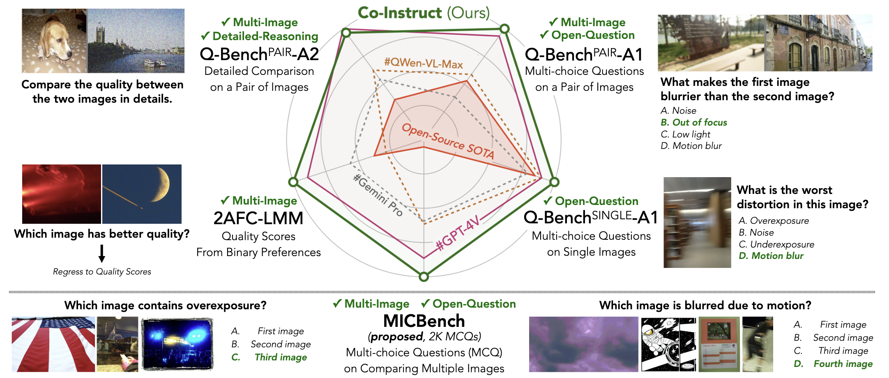

<div align="center">

<div>
   <a href="https://HuggingFace.co/q-future/co-instruct"><strong>HF AutoModel</strong></a> | <a href="https://huggingface.co/datasets/q-future/Co-Instruct-DB"><strong>Data Release</strong></a> |  <a href="https://arxiv.org/pdf/2402.16641.pdf"><strong>Technical Report</strong></a> | <a href="https://co-instruct.github.io/"><strong>Homepage</strong></a> | <a href="https://q-future-co-instruct.hf.space/"><strong>HF Space (Demo)</strong></a>
</div> 

 <div style="width: 80%; text-align: center; margin:auto;">
      
</div> 
<div>
  <h1>Towards Open-ended Visual Quality Comparison</h1> 
</div>
  
<div>
  <a href="https://teowu.github.io" target="_blank">Haoning Wu</a><sup>1*</sup>,
  <a href="https://github.com/h4nwei" target="_blank">Hanwei Zhu</a><sup>2*</sup>,
  <a href="https://github.com/zzc-1998" target="_blank">Zicheng Zhang</a><sup>3*</sup>,
  <a href="https://github.com/ZhangErliCarl/" target="_blank">Erli Zhang</a><sup>1</sup>,
  <a href="https://chaofengc.github.io" target="_blank">Chaofeng Chen</a><sup>1</sup>,
  <a href="https://liaoliang92.github.io" target="_blank">Liang Liao</a><sup>1</sup>,
  <a href="https://github.com/lcysyzxdxc" target="_blank">Chunyi Li</a><sup>3</sup>,
  <a href="https://github.com/AnnanWangDaniel" target="_blank">Annan Wang</a><sup>1</sup>
</div>
<div>
  <a href="https://wenxiusun.com" target="_blank">Wenxiu Sun</a><sup>4</sup>,
  <a href="https://scholar.google.com/citations?user=uT9CtPYAAAAJ&hl=en" target="_blank">Qiong Yan</a><sup>4</sup>,
  <a href="https://jhc.sjtu.edu.cn/~xiaohongliu/" target="_blank">Xiaohong Liu</a><sup>3</sup>,
  <a href="https://ee.sjtu.edu.cn/en/FacultyDetail.aspx?id=24&infoid=153&flag=153" target="_blank">Guangtao Zhai</a><sup>3</sup>,
  <a href="https://www.cs.cityu.edu.hk/~shiqwang/" target="_blank">Shiqi Wang</a><sup>2</sup>,
  <a href="https://personal.ntu.edu.sg/wslin/Home.html" target="_blank">Weisi Lin</a><sup>1</sup>
    </div>
    
  <sup>*</sup>Equal contribution.
</div>
    
<div style="width: 80%; text-align: center; margin:auto;">
      
</div> 
</div>

_An study on open-ended multi-image quality comparison: a dataset, a model and a benchmark._


## Demo

<script
	type="module"
	src="https://gradio.s3-us-west-2.amazonaws.com/3.50.0/gradio.js"
></script>

<gradio-app src="https://q-future-co-instruct.hf.space"></gradio-app>

## News

[Feb 24, 2024] A technical report for the data and model is coming soon.

## Quick Start

### Load Model

```python
import torch
from transformers import AutoModelForCausalLM

model = AutoModelForCausalLM.from_pretrained("q-future/co-instruct", 
                                             trust_remote_code=True, 
                                             torch_dtype=torch.float16,
                                             attn_implementation="eager", 
                                             device_map={"":"cuda:0"})
```

### Chat

```python
import requests
from PIL import Image


### Single Image
prompt = "USER: The image: <|image|> Which happens in this image: motion-blur, over-exposure, or under-exposure? ASSISTANT:"
url = "https://raw.githubusercontent.com/Q-Future/Q-Align/main/fig/singapore_flyer.jpg"
image = Image.open(requests.get(url,stream=True).raw)
model.chat(prompt, [image], max_new_tokens=200)

## Motion blur

### Double Image Comparison
prompt_cmp = "USER: The first image: <|image|>\nThe second image: <|image|>Which image has better quality, and why? ASSISTANT:"
url = "https://raw.githubusercontent.com/Q-Future/Q-Align/main/fig/boy_colorful.jpg"
image_2 = Image.open(requests.get(url,stream=True).raw)
model.chat(prompt_cmp, [image, image_2], max_new_tokens=200)

## The second image has better quality. The description indicates that the image has accurate exposure, precise focus, clear details, rich colors, and sufficient lighting. Additionally, the texture details are clear, and the composition is centered. In comparison, the first image has good clarity and rich texture details, but the lighting is slightly weak, which can affect the overall quality of the image. Therefore, the second image is of higher quality due to its accurate exposure, precise focus, clear details, rich colors, sufficient lighting, and centered composition.

```

## Data Release

Coming soon.

## Training Scripts

Coming soon.

## Cite Us

```bibtex
@misc{wu2024openended,
      title={Towards Open-ended Visual Quality Comparison}, 
      author={Haoning Wu and Hanwei Zhu and Zicheng Zhang and Erli Zhang and Chaofeng Chen and Liang Liao and Chunyi Li and Annan Wang and Wenxiu Sun and Qiong Yan and Xiaohong Liu and Guangtao Zhai and Shiqi Wang and Weisi Lin},
      year={2024},
      eprint={2402.16641},
      archivePrefix={arXiv},
      primaryClass={cs.CV}
}
```
