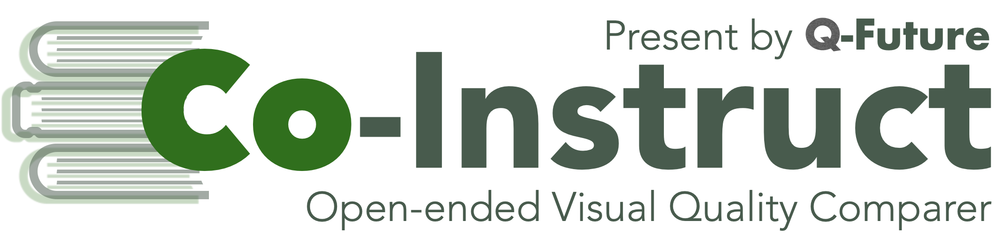
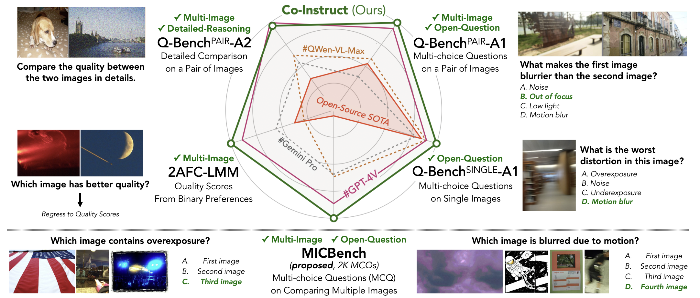

<div align="center">

<div>
   <a href="https://HuggingFace.co/q-future/co-instruct"><strong>HF AutoModel</strong></a> | <a href="https://huggingface.co/datasets/q-future/Co-Instruct-DB"><strong>Data Release</strong></a> |  <a href="https://arxiv.org/pdf/2402.16641.pdf"><strong>Technical Report</strong></a> | <a href="https://co-instruct.github.io/"><strong>Homepage</strong></a> | <a href="https://q-future-co-instruct.hf.space/"><strong>HF Space (Demo)</strong></a>
</div> 

 <div style="width: 80%; text-align: center; margin:auto;">
      
</div> 
<div>
  <h1>Towards Open-ended Visual Quality Comparison</h1> 

</div>
  
<div>
  <a href="https://teowu.github.io" target="_blank">Haoning Wu</a><sup>1*</sup>,
  <a href="https://github.com/h4nwei" target="_blank">Hanwei Zhu</a><sup>2*</sup>,
  <a href="https://github.com/zzc-1998" target="_blank">Zicheng Zhang</a><sup>3*</sup>,
  <a href="https://github.com/ZhangErliCarl/" target="_blank">Erli Zhang</a><sup>1</sup>,
  <a href="https://chaofengc.github.io" target="_blank">Chaofeng Chen</a><sup>1</sup>,
  <a href="https://liaoliang92.github.io" target="_blank">Liang Liao</a><sup>1</sup>,
  <a href="https://github.com/lcysyzxdxc" target="_blank">Chunyi Li</a><sup>3</sup>
</div>
<div>
  <a href="https://github.com/AnnanWangDaniel" target="_blank">Annan Wang</a><sup>1</sup>,
  <a href="https://wenxiusun.com" target="_blank">Wenxiu Sun</a><sup>4</sup>,
  <a href="https://scholar.google.com/citations?user=uT9CtPYAAAAJ&hl=en" target="_blank">Qiong Yan</a><sup>4</sup>,
  <a href="https://jhc.sjtu.edu.cn/~xiaohongliu/" target="_blank">Xiaohong Liu</a><sup>3</sup>,
  <a href="https://ee.sjtu.edu.cn/en/FacultyDetail.aspx?id=24&infoid=153&flag=153" target="_blank">Guangtao Zhai</a><sup>3</sup>,
  <a href="https://www.cs.cityu.edu.hk/~shiqwang/" target="_blank">Shiqi Wang</a><sup>2</sup>,
  <a href="https://personal.ntu.edu.sg/wslin/Home.html" target="_blank">Weisi Lin</a><sup>1</sup>
    </div>
    
  <div>
  <sup>*</sup>Equal contribution.
</div>
<div>
  ECCV2024 (Oral)
  </div>

    
<div style="width: 80%; text-align: center; margin:auto;">
      
</div> 
</div>

_A study on open-ended multi-image quality comparison: a dataset, a model and a benchmark._


## Demo

<a href="https://q-future-co-instruct.hf.space/"></a>

<script
	type="module"
	src="https://gradio.s3-us-west-2.amazonaws.com/3.50.0/gradio.js"
></script>

<gradio-app src="https://q-future-co-instruct.hf.space"></gradio-app>

## [Recommended] General LMMs with Co-Instruct Abilities

Several general-purpose open-source LMMs have integrated Co-Instruct into their training, which has as good visual quality comparison abilities while retaining as good general abilities. Please find thme as follows:

- [LLaVA-OneVision](https://huggingface.co/lmms-lab/llava-onevision-qwen2-72b-ov-sft)
- [mPLUG-OWl3](https://huggingface.co/mPLUG/mPLUG-Owl3-7B-240728)
- [Mantis](https://huggingface.co/TIGER-Lab/Mantis-8B-Idefics2)

We thank the authors of these projects to include our data into their training. Please try to use these models if you need a strong general-purpose LMM with decent open-ended visual quality comparison abilities.

## Model Inference

Quick Note: Please use `transformers==4.36` or ``transformers==4.37` to seamlessly run on 

### Load Model

```python
import torch
from transformers import AutoModelForCausalLM

model = AutoModelForCausalLM.from_pretrained("q-future/co-instruct", 
                                             trust_remote_code=True, 
                                             torch_dtype=torch.float16,
                                             attn_implementation="eager", 
                                             device_map={"":"cuda:0"})
```

### Chat

```python
import requests
from PIL import Image


### Single Image
prompt = "USER: The image: <|image|> Which happens in this image: motion-blur, over-exposure, or under-exposure? ASSISTANT:"
url = "https://raw.githubusercontent.com/Q-Future/Q-Align/main/fig/singapore_flyer.jpg"
image = Image.open(requests.get(url,stream=True).raw)
model.chat(prompt, [image], max_new_tokens=200)

## Motion blur

### Double Image Comparison
prompt_cmp = "USER: The first image: <|image|>\nThe second image: <|image|>Which image has better quality, and why? ASSISTANT:"
url = "https://raw.githubusercontent.com/Q-Future/Q-Align/main/fig/boy_colorful.jpg"
image_2 = Image.open(requests.get(url,stream=True).raw)
model.chat(prompt_cmp, [image, image_2], max_new_tokens=200)

## The second image has better quality. The description indicates that the image has accurate exposure, precise focus, clear details, rich colors, and sufficient lighting. Additionally, the texture details are clear, and the composition is centered. In comparison, the first image has good clarity and rich texture details, but the lighting is slightly weak, which can affect the overall quality of the image. Therefore, the second image is of higher quality due to its accurate exposure, precise focus, clear details, rich colors, sufficient lighting, and centered composition.

```

## Data Release

We have relesed the training data on HuggingFace datasets on LLaVA format.

Please find on the link: https://huggingface.co/datasets/q-future/Co-Instruct-DB or use as follows:

```shell
huggingface-cli download q-future/Co-Instruct-DB --local-dir Co-Instruct-DB --repo-type datasets
tar -xf co-insruct-imageds.tar
```

The extracted data will look as follows:
```
-- Co-Instruct-DB/
-- -- coinstruct_562k_llava_format.json
-- -- data/
```

The data in the JSON contains 562K dicts, each corresponding to a piece of SFT data item. 

For MICBench, our team notices that there are some cases with NSFW contents, and we may need to distribute it after making sure it is only used for research purpose. Please email `haoning001@e.ntu.edu.sg` to obtain it.

## Training Recipe

For training, please refer to the [Q-Align](https://github.com/Q-Future/Q-Align) codebase, which is a modified version of mPLUG-Owl2 that supports multi-image training. Please use the following script for training:

```shell
#!/bin/bash
# Use 8 GPUs to replicate the training

LOAD='MAGAer13/mplug-owl2-llama2-7b'

echo 'Converting data format...'
sed 's/<image>/<|image|>/g' Co-Instruct-DB/coinstruct_562k_llava_format.json > Co-Instruct-DB/coinstruct_562k_mplugowl2_format.json

echo 'Start training!'

DATA_FILE=Co-Instruct-DB/coinstruct_562k_mplugowl2_format.json
deepspeed --master_port 25801 q_align/train/train_mem.py \
    --deepspeed ./scripts/zero3.json \
    --model_name_or_path $LOAD \
    --version v1 \
    --data_path $DATA_FILE \
    --image_folder Co-Instruct-DB/ \
    --image_aspect_ratio pad \
    --group_by_modality_length True \
    --bf16 True \
    --output_dir ./coinstruct_replicated \
    --num_train_epochs 1 \
    --per_device_train_batch_size 24 \
    --per_device_eval_batch_size 4 \
    --gradient_accumulation_steps 1 \
    --evaluation_strategy "no" \
    --save_strategy "steps" \
    --save_steps 1100 \
    --save_total_limit 2 \
    --learning_rate 2e-5 \
    --weight_decay 0. \
    --warmup_ratio 0.03 \
    --lr_scheduler_type "cosine" \
    --logging_steps 1 \
    --tf32 True \
    --model_max_length 2048 \
    --gradient_checkpointing True \
    --tune_visual_abstractor True \
    --freeze_vision_model False \
    --dataloader_num_workers 4 \
    --lazy_preprocess True \
    --report_to wandb
```

## Cite Us

```bibtex
@misc{wu2024openended,
      title={Towards Open-ended Visual Quality Comparison}, 
      author={Haoning Wu and Hanwei Zhu and Zicheng Zhang and Erli Zhang and Chaofeng Chen and Liang Liao and Chunyi Li and Annan Wang and Wenxiu Sun and Qiong Yan and Xiaohong Liu and Guangtao Zhai and Shiqi Wang and Weisi Lin},
      year={2024},
      eprint={2402.16641},
      archivePrefix={arXiv},
      primaryClass={cs.CV}
}
```
